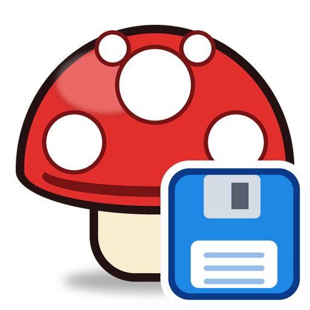
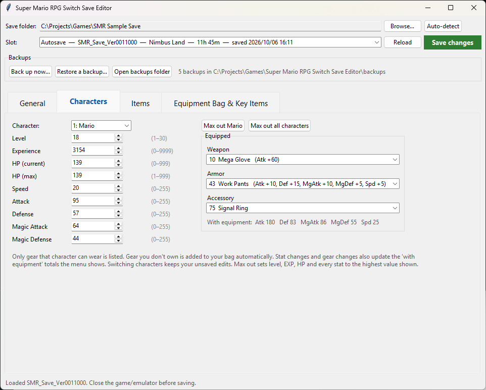
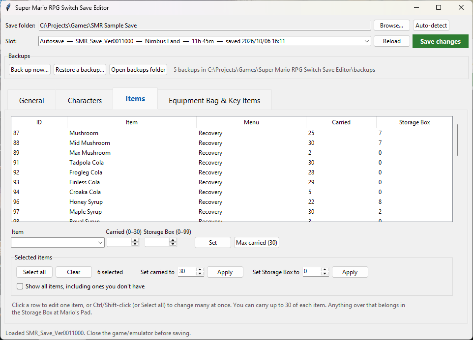
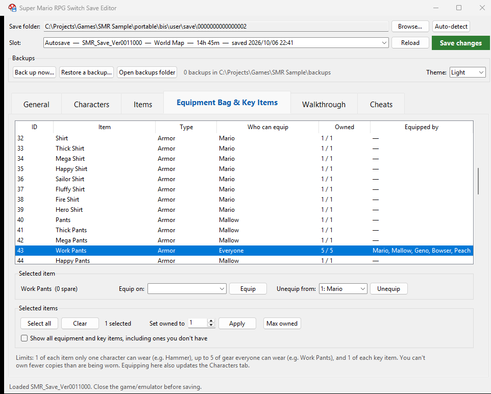
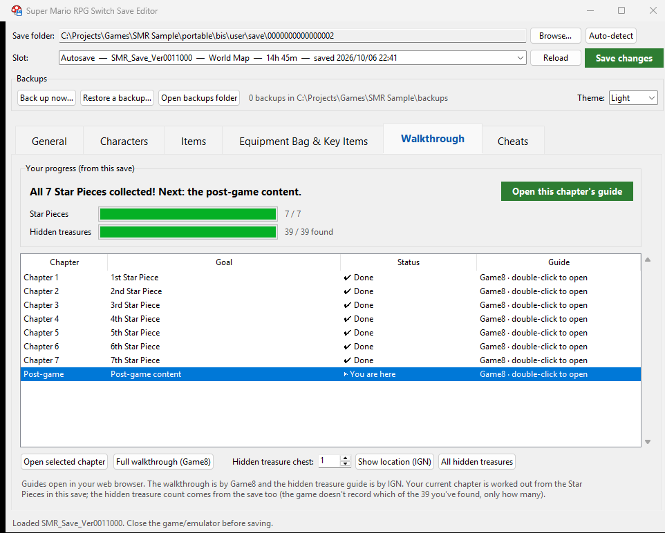
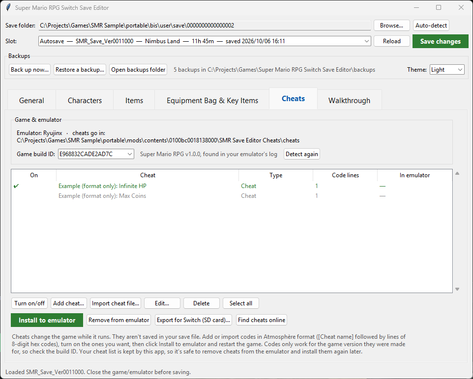
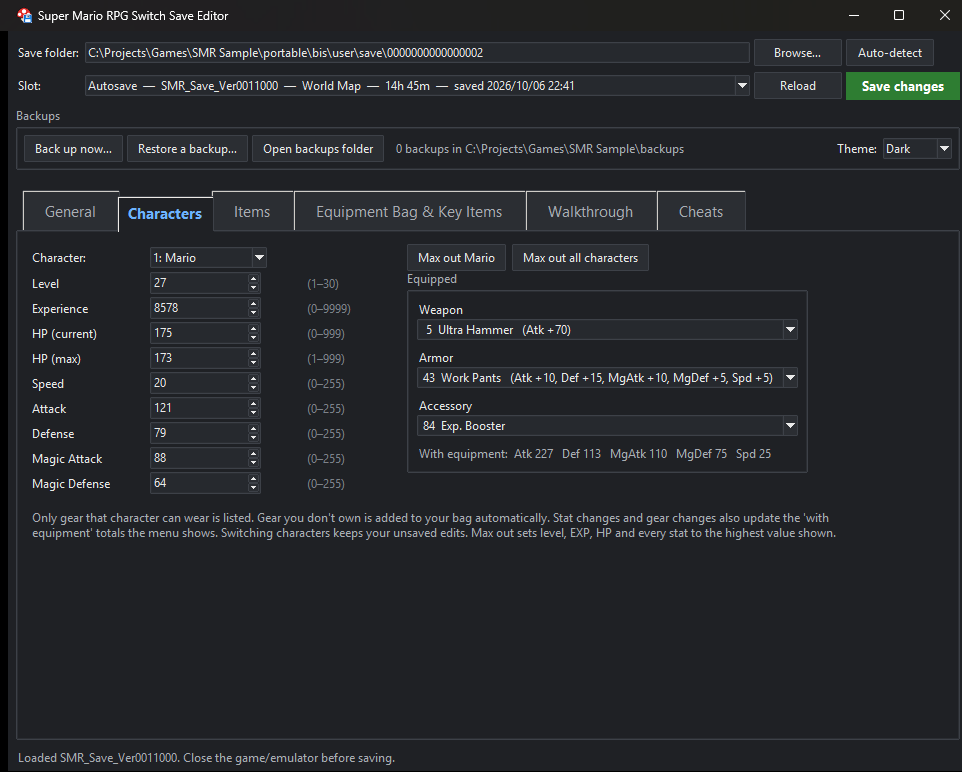
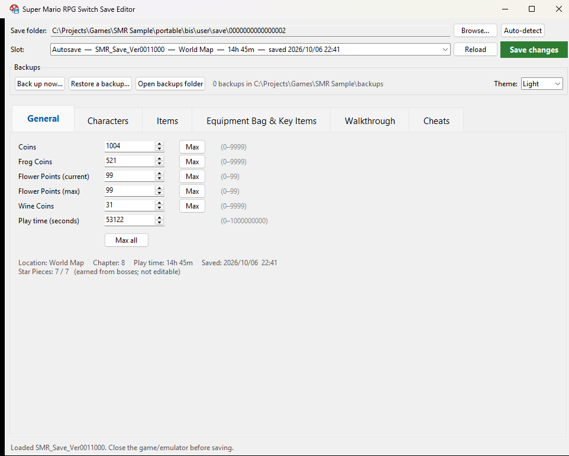

<div align="center">



# Super Mario RPG Switch Save Editor

**A friendly desktop save editor for *Super Mario RPG* (Nintendo Switch, 2023 remake).**
Works with saves from a real Switch and from every major Switch emulator.

[](LICENSE)




[Features](#-features) · [Download](#-download) · [How to use](#-how-to-use) · [Your system](#-instructions-by-system) · [Walkthrough](#%EF%B8%8F-walkthrough) · [Cheats](#-cheats) · [Item IDs](#-item-ids) · [FAQ](#-faq)

</div>

---

## ✨ Features

| | |
|---|---|
| 💰 **Money & FP** | Coins, Frog Coins, Flower Points, Wine Coins and play time, each with a **Max** button (plus **Max all**) |
| 🧑‍🤝‍🧑 **Characters** | Level, EXP, HP and all five stats for Mario, Mallow, Geno, Bowser and Peach. **Max out** one character or all of them in one click |
| 🔨 **Equipment** | Change each character's weapon, armor and accessory. Only gear they can wear is listed, with its stat bonuses |
| 🎒 **Items & Storage Box** | Every consumable by name. Set how many you carry (up to 30) and how many are in the Storage Box at Mario's Pad. Multi-select or **Select all** to change many items at once |
| 🗝️ **Equipment bag & key items** | Every piece of gear and every key item with how many you own, who can equip it and who's wearing it. Equip and unequip, multi-select, **Select all** and **Max owned**, with sensible limits |
| 🎮 **Cheats** | Add or import cheat codes, switch them on and off, and install them into Ryujinx or a yuzu-family emulator in one click, or export them for a Switch running Atmosphère |
| 🗺️ **Walkthrough** | Shows the chapter you're on, Star Pieces and hidden treasures found (read from your save), with one-click links to the Game8 chapter guides and IGN's hidden treasure locations |
| 🌗 **Light & dark mode** | Light, Dark, or follow your Windows setting, including a dark title bar |
| ↕️ **Sortable lists** | Click any column heading to sort; click again to reverse |
| 🔍 **Review before saving** | A window lists every change, like *"Mario Weapon: Hammer → Super Hammer"*, before anything is written |
| 🛟 **Backups** | Warns you before saving if your save isn't backed up, plus unlimited manual backups with notes and one-click restore |
| 🔒 **Safe by design** | Anything you don't edit is written back byte-for-byte as the game wrote it |

<details>
<summary><b>📸 More screenshots</b></summary>

<br>

**Items & Storage Box**



**Equipment Bag & Key Items**



**Walkthrough**



**Cheats** (the two cheats shown are format examples, not real codes)



**Dark mode**



**General**



</details>

---

## 📥 Download

| | |
|---|---|
| 🪟 **Windows (recommended)** | Download **`Super-Mario-RPG-Switch-Save-Editor-Portable.zip`** from the [**latest release**](../../releases/latest), unzip it anywhere, and double-click **`Super Mario RPG Switch Save Editor.exe`** inside. Nothing to install, and it works with **Smart App Control**: the program you start is the official Python runtime, signed by the Python Software Foundation, bundled with the editor. |
| 🪟 **Windows (single file)** | **`Super-Mario-RPG-Switch-Save-Editor.exe`** from the same release. Handier, but it isn't code-signed yet (see below). |
| 🐍 **Any OS (from source)** | Install [Python 3.8+](https://www.python.org/downloads/) and run `python smr_save_editor.py`. On Windows you can also double-click `Open Save Editor.bat`. On Linux, also install `python3-tk`. |

> [!NOTE]
> **The single-file `.exe` isn't code-signed yet**, so Windows may stop it:
> - **SmartScreen** ("Windows protected your PC"): click **More info → Run anyway**.
> - **Smart App Control** ("This app has been blocked"): there's no "run anyway" option, so use the **portable zip** instead. Turning Smart App Control off isn't recommended, because on many PCs it can't be turned back on without resetting Windows.
>
> In the portable version, the program file shows the Python icon (changing it would break the signature), but the editor's window and taskbar use the mushroom. To uninstall, delete the folder.

---

## 🚀 How to use

> [!IMPORTANT]
> **Close the game or emulator first.** If it's still running, it can overwrite your edits the next time it saves.

1. **Open the editor.** It looks for your save automatically. If it can't find it, click **Browse…** and pick your save folder, or any folder above it.
2. **Pick a slot** from the dropdown. It shows the location, play time and save date.
3. **Make your changes** in the tabs.
4. Click the green **Save changes** button, check the summary, and confirm. If your save isn't backed up yet, the editor offers to back it up first.

---

## 🎮 Instructions by system

The save files are the same on every system. Only where they live is different.

<details open>
<summary><b>🟥 Ryujinx</b> (Windows / macOS / Linux)</summary>

<br>

1. In Ryujinx, right-click **Super Mario RPG** → **Open User Save Directory** to find your save.
2. Close Ryujinx.
3. Open the editor. It usually finds the save by itself. If not, Browse to that folder: it's the one with the `0` and `1` subfolders.
4. Edit and save. Ryujinx keeps two copies (`0` and `1`), and the editor updates both.

| OS | Default save location |
|---|---|
| Windows | `%APPDATA%\Ryujinx\bis\user\save\<number>\` |
| Windows (portable) | `<Ryujinx folder>\portable\bis\user\save\<number>\` |
| macOS | `~/Library/Application Support/Ryujinx/bis/user/save/<number>/` |
| Linux | `~/.config/Ryujinx/bis/user/save/<number>/` |

</details>

<details>
<summary><b>🟦 yuzu family</b>: yuzu, suyu, sudachi, citron, eden, torzu</summary>

<br>

1. Right-click **Super Mario RPG** → **Open Save Data Location**.
2. Close the emulator.
3. Open the editor. It usually finds the save by itself. If not, Browse to that folder (it ends in `0100BC0018138000`).
4. Edit and save.

| OS | Default save location |
|---|---|
| Windows | `%APPDATA%\<emulator>\nand\user\save\0000000000000000\<user id>\0100BC0018138000\` |
| Linux | `~/.local/share/<emulator>/nand/user/save/0000000000000000/<user id>/0100BC0018138000/` |

</details>

<details>
<summary><b>📱 Android emulators</b> (eden, citron, sudachi, …)</summary>

<br>

The editor is a desktop app, so move the save to a PC and back:

1. Export the save with the emulator's save-data option, or copy the `nand/user/save/…/0100BC0018138000` folder from the emulator's data folder on your phone.
2. Copy it to a PC, open it in the editor, edit and save.
3. Copy the edited files back to the same place on your phone, then start the game.

</details>

<details>
<summary><b>🕹️ Real Nintendo Switch</b> (homebrew required)</summary>

<br>

You need a Switch that can run homebrew, plus a save manager like [JKSV](https://github.com/J-D-K/JKSV) or [Checkpoint](https://github.com/BernardoGiordano/Checkpoint).

1. **Back up on the Switch:** in JKSV or Checkpoint, select your user → **Super Mario RPG** → **New backup**. It's saved to the SD card:
   - JKSV: `sd:/JKSV/Super Mario RPG/<backup name>/`
   - Checkpoint: `sd:/switch/Checkpoint/saves/0x0100BC0018138000 Super Mario RPG/<backup name>/`
2. **Copy that folder to your PC.** Keep an untouched copy too.
3. **Edit:** open the folder in the editor with **Browse…**, make your changes and save.
4. **Copy the edited folder back** to the same place on the SD card.
5. **Restore on the Switch:** select that backup in JKSV or Checkpoint → **Restore**, then start the game.

> [!NOTE]
> **Cloud saves:** Nintendo Switch Online cloud saves can't be edited directly. Edit the save on the console, and if you use cloud backup, upload the edited save afterwards.
>
> **Switch 2:** the save format is the same. If your Switch 2 can run a save manager, the steps are the same. Otherwise there's no way to get the save off the console.

</details>

---

## 📂 Save files

| File | What it is |
|---|---|
| `SMR_Save_Ver0011000` | ⏱️ Autosave |
| `SMR_Save_Ver0011002` | 1️⃣ Slot 1 |
| `SMR_Save_Ver0011003` | 2️⃣ Slot 2 |
| `SMR_Save_Ver0011004` | 3️⃣ Slot 3 |
| `SMR_Save_Ver0011005` | 🪞 The game's backup copy of your last save. The editor updates it together with that slot. |
| `SMR_Save_Ver0011_image` | 🖼️ Save thumbnail (not edited) |

The files are plain JSON text encoded as UTF-16 LE. They have no checksum or encryption.

---

## 🛟 Backups

- **Before saving, the editor checks whether your save is backed up.** It compares your save files with your backups:
  - ✅ **A backup matches your save exactly:** it saves right away, with no warning.
  - ✅ **You're making another edit and haven't played since your last one:** it saves and quietly makes a backup, so every edit can be undone.
  - ⚠️ **You have no backups, or you've played since your newest one:** a warning shows how old your newest backup is and offers **Back up and save**, **Save without a backup**, or **Cancel**.
- Every restore backs up your current save first, so a restore can always be undone.
- **Back up now…** makes a manual backup, with an optional note like *"before Bowser's Keep"*.
- **Restore a backup…** lists your backups newest first. You can delete old ones there too.
- Backups live in a `backups` folder next to the editor. There's no limit on how many you keep.

---

## 🗺️ Walkthrough

The **Walkthrough** tab reads your progress from the save you've loaded:

- **Your chapter:** worked out from your Star Pieces, with a button that opens that chapter's guide.
- **Star Pieces and hidden treasures:** progress bars showing how many you have. The game only records how many of the 39 hidden treasures you've found, not which ones.
- **Every chapter:** marked done, current or upcoming. Double-click one to open its guide.
- **A chest number box:** jumps straight to that hidden treasure's location.

The guides are written by [Game8](https://game8.co/games/Super-Mario-RPG/archives/417834) and [IGN](https://www.ign.com/wikis/super-mario-rpg-switch-remake/Hidden_Treasure_Chest_Locations) and open in your web browser; they aren't copied into the app.

---

## 🎮 Cheats

> [!WARNING]
> **Cheats are experimental.** A code only works for the exact game version it was made for, and may behave differently between emulators. A mismatched code can crash the game or corrupt your save, so **back up first**. Read the full **[cheat guide](docs/CHEATS.md)** before you start.

Cheats change the game **while it's running** (things like infinite HP or EXP multipliers), so they aren't part of your save file. The **Cheats** tab (the last tab) manages them for you.

1. **Get cheat codes** from the community, e.g. [CheatSlips](https://www.cheatslips.com/game/super-mario-rpg) or GBAtemp. The **Find cheats online** button opens CheatSlips. Codes use the Atmosphère format:
   ```
   [Cheat name]
   04000000 01234567 0000270F
   ```
   *(This shows the format only. It isn't a real code for this game.)*
2. **Import** a cheat file, or **Add cheat…** and paste a code. Invalid codes are rejected with a clear message.
3. **Turn on** the cheats you want: double-click a row, or select rows and click **Turn on/off**.
4. Click **Install to emulator**, then restart the game.

| Where | What the editor does |
|---|---|
| **Ryujinx** | Writes the cheats to `mods\contents\0100bc0018138000\SMR Save Editor Cheats\cheats\<build ID>.txt` and switches them on in Ryujinx's `enabled.txt`. They also show in Ryujinx's **Manage Cheats** window. |
| **yuzu family** | Writes the cheats to `load\0100BC0018138000\SMR Save Editor Cheats\cheats\<build ID>.txt`. Make sure the **SMR Save Editor Cheats** add-on is enabled in the game's properties. |
| **Switch (Atmosphère)** | **Export for Switch (SD card)…** writes `atmosphere/contents/0100BC0018138000/cheats/<build ID>.txt` to your SD card. Toggle cheats in game with EdiZon or Breeze. |

> [!IMPORTANT]
> Cheat codes only work for the **exact game version** they were written for. The editor reads your game's **build ID** from Ryujinx's log (v1.0.0 is `E968832CADE2AD7C`). You can also type it in: Ryujinx shows it at the top of **Manage Cheats**.

Your cheats are filed in the **[`cheats`](cheats/README.md)** folder by game version, with a description and a **Tested on** result (Ryujinx / yuzu family / Switch) for each one, ready to share.

The editor only manages its own cheat file, so it never touches cheats you installed another way. Your cheat list is kept by the app, so removing cheats from the emulator doesn't lose them.

---

## 📖 Item IDs

The save stores every item as a number from **0 to 167**. Click a category to expand it. *Stats* are the bonuses a piece of equipment adds.

<details>
<summary><b>🔨 Weapons</b> (34)</summary>

| ID | Name | Who can equip | Stats |
|---:|---|---|---|
| 1 | Hammer | Mario | Atk +10 |
| 2 | Super Hammer | Mario | Atk +40 |
| 3 | Masher | Mario | Atk +50 |
| 4 | Lucky Hammer | Mario | — |
| 5 | Ultra Hammer | Mario | Atk +70 |
| 6 | NokNok Shell | Mario | Atk +20 |
| 7 | Troopa Shell | Mario | Atk +50 |
| 8 | Lazy Shell (weapon) | Mario | Atk +90 |
| 9 | Punch Glove | Mario | Atk +30 |
| 10 | Mega Glove | Mario | Atk +60 |
| 11 | Froggie Stick | Mallow | Atk +20 |
| 12 | Ribbit Stick | Mallow | Atk +50 |
| 13 | Cymbals | Mallow | Atk +30 |
| 14 | Sonic Cymbal | Mallow | Atk +70 |
| 15 | Whomp Glove | Mallow | Atk +35 |
| 16 | Sticky Glove | Mallow | Atk +60 |
| 17 | Finger Shot | Geno | Atk +12 |
| 18 | Hand Gun | Geno | Atk +24 |
| 19 | Hand Cannon | Geno | Atk +45 |
| 20 | Star Gun | Geno | Atk +57 |
| 21 | Double Punch | Geno | Atk +35 |
| 22 | Chomp Shell | Bowser | Atk +9 |
| 23 | Chomp | Bowser | Atk +10 |
| 24 | Spiked Link | Bowser | Atk +30 |
| 25 | Hurly Gloves | Bowser | Atk +20 |
| 26 | Drill Claw | Bowser | Atk +40 |
| 27 | Slap Glove | Peach | Atk +40 |
| 28 | Super Slap | Peach | Atk +70 |
| 29 | Parasol | Peach | Atk +50 |
| 30 | War Fan | Peach | Atk +60 |
| 31 | Frying Pan | Peach | Atk +90 |
| 158 | Sage Stick | Mallow | Atk +80, Mg Atk +15 |
| 159 | Stella 023 | Geno | Atk +62 |
| 160 | Wonder Chomp | Bowser | Atk +57 |

</details>

<details>
<summary><b>🛡️ Armor</b> (34)</summary>

| ID | Name | Who can equip | Stats |
|---:|---|---|---|
| 32 | Shirt | Mario | Def +6, Mg Def +6 |
| 33 | Thick Shirt | Mario | Def +12, Mg Def +8 |
| 34 | Mega Shirt | Mario | Def +18, Mg Def +10 |
| 35 | Happy Shirt | Mario | Def +24, Mg Def +12 |
| 36 | Sailor Shirt | Mario | Def +30, Mg Def +15 |
| 37 | Fluffy Shirt | Mario | Def +36, Mg Def +18 |
| 38 | Fire Shirt | Mario | Def +42, Mg Def +21 |
| 39 | Hero Shirt | Mario | Def +48, Mg Def +24 |
| 40 | Pants | Mallow | Def +6, Mg Def +3 |
| 41 | Thick Pants | Mallow | Def +12, Mg Def +6 |
| 42 | Mega Pants | Mallow | Def +18, Mg Def +9 |
| 43 | Work Pants | Everyone | Atk +10, Def +15, Mg Atk +10, Mg Def +5, Spd +5 |
| 44 | Happy Pants | Mallow | Def +24, Mg Def +12 |
| 45 | Sailor Pants | Mallow | Def +30, Mg Def +15 |
| 46 | Fluffy Pants | Mallow | Def +36, Mg Def +18 |
| 47 | Fire Pants | Mallow | Def +42, Mg Def +21 |
| 48 | Prince Pants | Mallow | Def +48, Mg Def +24 |
| 49 | Mega Cape | Geno | Def +6, Mg Def +3 |
| 50 | Happy Cape | Geno | Def +12, Mg Def +6 |
| 51 | Sailor Cape | Geno | Def +18, Mg Def +9 |
| 52 | Fluffy Cape | Geno | Def +24, Mg Def +12 |
| 53 | Fire Cape | Geno | Def +30, Mg Def +15 |
| 54 | Star Cape | Geno | Def +36, Mg Def +18 |
| 55 | Happy Shell | Bowser | Def +6, Mg Def +3 |
| 56 | Courage Shell | Bowser | Def +12, Mg Def +6 |
| 57 | Fire Shell | Bowser | Def +18, Mg Def +9 |
| 58 | Heal Shell | Bowser | Def +24, Mg Def +12 |
| 59 | Lovely Dress | Peach | Def +24, Mg Def +12 |
| 60 | Sailor Dress | Peach | Def +30, Mg Def +15 |
| 61 | Fluffy Dress | Peach | Def +36, Mg Def +18 |
| 62 | Fire Dress | Peach | Def +42, Mg Def +21 |
| 63 | Royal Dress | Peach | Def +48, Mg Def +24 |
| 64 | Super Suit | Everyone | Atk +50, Def +50, Mg Atk +50, Mg Def +50, Spd +30 |
| 65 | Lazy Shell (armor) | Everyone | Atk -50, Def +127, Mg Atk -50, Mg Def +127, Spd -50 |

</details>

<details>
<summary><b>💍 Accessories</b> (24)</summary>

| ID | Name | Who can equip | Stats |
|---:|---|---|---|
| 66 | Jump Shoes | Mario | Def +1, Mg Atk +5, Mg Def +1, Spd +2 |
| 67 | Zoom Shoes | Everyone | Def +5, Mg Def +5, Spd +10 |
| 68 | Antidote Pin | Everyone | Def +2, Mg Def +2 |
| 69 | Wake-Up Pin | Everyone | Def +3, Mg Def +3 |
| 70 | Trueform Pin | Everyone | Def +4, Mg Def +4 |
| 71 | Fearless Pin | Everyone | Def +5, Mg Def +5 |
| 72 | Safety Badge | Everyone | Def +5, Mg Def +5 |
| 73 | Nurture Ring | Peach | — |
| 74 | Safety Ring | Everyone | Def +5, Mg Def +5, Spd +5 |
| 75 | Signal Ring | Everyone | — |
| 76 | Jinx Belt | Everyone | Atk +27, Def +27, Spd +12 |
| 77 | Defense Scarf | Everyone | Def +15, Mg Def +15 |
| 78 | Attack Scarf | Mario | Atk +30, Def +30, Mg Atk +30, Mg Def +30, Spd +30 |
| 79 | Feather | Everyone | Def +5, Mg Def +5, Spd +20 |
| 80 | Troopa Medal | Everyone | Spd +20 |
| 81 | Ghost Medal | Everyone | — |
| 82 | Booster's Charm | Everyone | Atk +7, Def +7, Mg Atk +7, Mg Def +7, Spd -5 |
| 83 | Quartz Charm | Everyone | — |
| 84 | Exp. Booster | Everyone | — |
| 85 | Coin Trick | Mario | — |
| 86 | Flower Ring | Everyone | — |
| 161 | Enduring Brooch | Everyone | — |
| 162 | Teamwork Band | Everyone | — |
| 167 | Echo Signal Ring | Everyone | Spd +10 |

</details>

<details>
<summary><b>🍄 Consumable items</b> (44)</summary>

| ID | Name | Menu |
|---:|---|---|
| 87 | Mushroom | Recovery |
| 88 | Mid Mushroom | Recovery |
| 89 | Max Mushroom | Recovery |
| 90 | Yoshi Candy | Recovery |
| 91 | Tadpola Cola | Recovery |
| 92 | Frogleg Cola | Recovery |
| 93 | Finless Cola | Recovery |
| 94 | Croaka Cola | Recovery |
| 95 | Thropher Cookie | Recovery |
| 96 | Honey Syrup | Recovery |
| 97 | Maple Syrup | Recovery |
| 98 | Royal Syrup | Recovery |
| 99 | Flower Tab | Recovery (menu only) |
| 100 | Flower Jar | Recovery (menu only) |
| 101 | Flower Box | Recovery (menu only) |
| 102 | Pick Me Up | Battle |
| 103 | Cleansing Juice | Battle |
| 104 | Party Cleanse | Battle |
| 105 | Bracer | Battle |
| 106 | Energizer | Battle |
| 107 | Party Bracer | Battle |
| 108 | Party Energizer | Battle |
| 109 | Yoshi-Ade | Battle |
| 110 | Red Essence | Battle |
| 111 | Pure Water | Battle |
| 112 | Poison Mushroom | Battle |
| 113 | Sleepy Bomb | Battle |
| 114 | Fright Bomb | Battle |
| 115 | Fire Bomb | Battle |
| 116 | Ice Bomb | Battle |
| 117 | Rock Candy | Battle |
| 118 | Star Egg | Battle |
| 119 | Mystery Egg | Battle |
| 120 | Lamb's Lure | Battle |
| 121 | Sheep Attack | Battle |
| 122 | See Ya | Battle |
| 123 | Earlier Times | Battle |
| 124 | Yoshi Cookie | Battle |
| 125 | Goodie Bag | Battle |
| 126 | Lucky Jewel | Battle |
| 127 | Wilt Shroom | Recovery |
| 128 | Rotten Mush | Recovery |
| 129 | Moldy Mush | Recovery |
| 130 | Mushroom (Triplets) | Recovery |

</details>

<details>
<summary><b>🗝️ Key items</b> (29)</summary>

| ID | Name |
|---:|---|
| 131 | Special Frog Coin |
| 132 | Wallet |
| 133 | Cricket Pie |
| 134 | Cricket Jam |
| 135 | Carbo Cookie |
| 136 | Alto Card |
| 137 | Tenor Card |
| 138 | Soprano Card |
| 139 | Bright Card |
| 140 | Microbomb |
| 141 | Fireworks |
| 142 | Shiny Stone |
| 143 | Elder Key |
| 144 | Room Key |
| 145 | Shed Key |
| 146 | Temple Key |
| 147 | Castle Key 1 |
| 148 | Castle Key 2 |
| 149 | Beetle Box (empty) |
| 150 | Beetle Box |
| 151 | Dry Bones Flag |
| 152 | Greaper Flag |
| 153 | Boo Flag |
| 154 | Seed |
| 155 | Fertilizer |
| 163 | Crystal Shard |
| 164 | Stay Voucher |
| 165 | Extra-Shiny Stone |
| 166 | Monster Trophy |

</details>

IDs 156 and 157 are unused.

---

## ❓ FAQ

<details>
<summary><b>Why can't I edit Star Pieces?</b></summary>

<br>

Star Pieces aren't a counter. Each star is one bit set by a story event when you beat that boss. Changing it by hand could break progress, so the editor shows it read-only, as *collected / 7*.

</details>

<details>
<summary><b>Can I edit key items?</b></summary>

<br>

Yes, on the **Equipment Bag & Key Items** tab, up to 1 of each. Key items are tied to story progress, though: adding one early or removing one you still need can block the story. The editor asks you to confirm the first time you change key items each session.

</details>

<details>
<summary><b>How many pieces of equipment can I own?</b></summary>

<br>

- **1** of each item only one character can wear, like Hammer or Froggie Stick.
- **Up to 5** of gear every character can wear, like Work Pants or Exp. Booster.
- **1** of each key item.

You can't set the amount below the number of copies being worn. Unequip them first.

</details>

<details>
<summary><b>What does "Max out" do to a character?</b></summary>

<br>

It sets level 30, 9,999 EXP (the game's cap, enough for level 30), 999 HP and 255 in every stat. The stats shown with equipment are updated to match.

</details>

<details>
<summary><b>Why is the item limit 30?</b></summary>

<br>

That's the most of one item you can carry. Anything above it goes to the Storage Box at Mario's Pad, which the editor lets you fill as well (up to 99 per item).

There's also a **total** limit: the save stores your bag as a fixed list of **1,200 slots**, one per item you carry. There are 44 kinds of items, so 30 of every one would be 1,320, which doesn't fit. The Items tab shows how many slots you're using, and the editor won't save more than the game has room for. Writing past it could break the save. The Storage Box doesn't share this limit, so put extras there.

</details>

<details>
<summary><b>Some characters say "(not joined yet)". Can I edit them?</b></summary>

<br>

Yes. Their stats and gear are already in the save. The changes apply once they join your party.

</details>

<details>
<summary><b>My gear stats look slightly off after equipping.</b></summary>

<br>

The stats for the post-game weapons (Sage Stick, Stella 023, Wonder Chomp) come from community sources and may be slightly off. Re-equip the item in-game and the game recalculates them.

</details>

<details>
<summary><b>Can the editor make new cheats, like a guaranteed bonus after every battle?</b></summary>

<br>

No. A cheat code needs memory addresses found by reverse-engineering the exact game version, so the editor can only install codes that someone has already made and shared. There's also no "no random encounters" cheat needed: the remake has no random encounters, because enemies are visible on the map.

</details>

<details>
<summary><b>Something went wrong. How do I undo it?</b></summary>

<br>

Click **Restore a backup…** and choose the newest backup from before your last save. Backups the editor makes are labelled *before edit*.

</details>

---

## 🙏 Credits

- Item IDs and names: [Echocolat/SMR-save-edit-scripts](https://github.com/Echocolat/SMR-save-edit-scripts)
- Walkthrough links: [Game8](https://game8.co/games/Super-Mario-RPG/archives/417834) and [IGN](https://www.ign.com/wikis/super-mario-rpg-switch-remake/Hidden_Treasure_Chest_Locations)
- Equipment stats: [Nintendo Life](https://www.nintendolife.com/guides/super-mario-rpg-all-weapons-list), [Gamer Guides](https://gamerguides.com/super-mario-rpg-2023/guide/getting-started/basics/all-armor-in-super-mario-rpg), [Samurai Gamers](https://samurai-gamers.com/super-mario-rpg-remake/weapons-list-19/) and the [Super Mario Wiki](https://www.mariowiki.com/)

## 📄 License

[MIT](LICENSE). Use it, change it, share it.

<sub>Not affiliated with or endorsed by Nintendo. *Super Mario RPG* is a trademark of Nintendo. Always keep a backup of your save.</sub>
